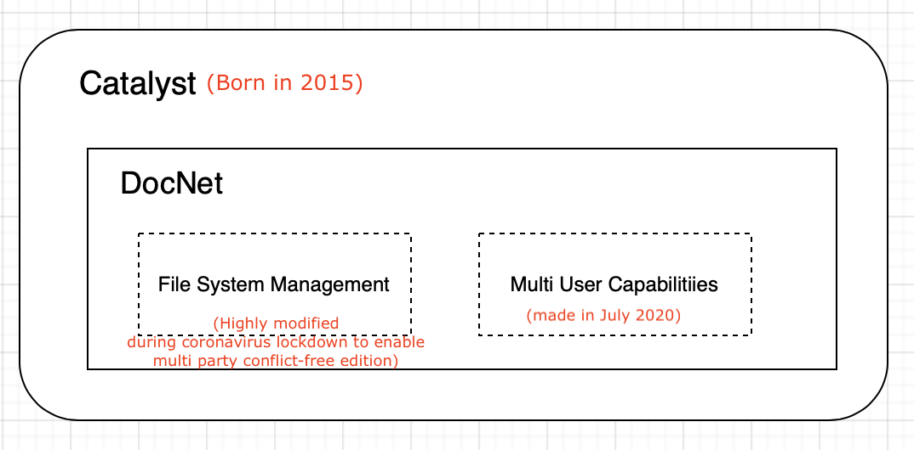

This software, for some reasons, is known under two different name: **Catalyst** and **DocNet** (Multi-user **Doc**umentation **Net**work). If you are coming from the Guardian, you are looking for [DocNet](documentation/DocNet.md) 🙂

**Q: What exactly is the relationship betweeen Catalyst and DocNet ?** 🤔

- DocNet and Catalyst are actually the same program, with the following differences: 
	- DocNet uses a limited set of features and a limited data model.
	- They run on different data stores. At the time those lines are written (July 2020), the DocNet data store is still mostly empty, while Catalyst manages 30Gb+ of Pascal's personal data.
	- Note that despite being a *limited version*, DocNet has an important ability that Catalyst doesn't: multiple instances of DocNet can synchronise and share their data updates. (Giving DocNet its distributed multi-users capabilities.) 

**Q: What is the latest in terms of roadmap ?** 👩‍💻

- As of July 2020, most of the effort has recently been put into reorganizing Catalyst's data model and make its DocNet subset multi-user. 
- Catalyst and DocNet are going to be re-written in Go by the end of 2020.
- DocNet features that may appear in the future include, but are not limited to:
	- Enablying end to end encryption between users.
	- Possibly user credentials management. 
	- Possibly some sort of a web interface (for better knowledge graph visualisation).
	- Shipping DocNet as an independant program independant of Catalyst, but this will only happen after the entire system has been rewritten in Go.

**Q: How can I help ?** 

- So... right now (Summer 2020), contributing to the code would not be that helpful (unless you already know Ruby and spot a bug and feel like correcting it). Catalyst (and DocNet inside it) is going to be rewritten from scratch in Go --a much better language and much better ecosystem for what I ultimately want DocNet to be--. One priceless way you can help would be to use it, mostly by starting collecting documentation in it (and sharing that with the rest of the current test users). 📚
- DocNet will ultimately have some sort of a web interface (some things are better expressed on a Graphical UI), even though it will also always have a fully functioning and arguably more feature rich command line interface. If somebody wants to think about that (or start doing something). Do let me know :)
