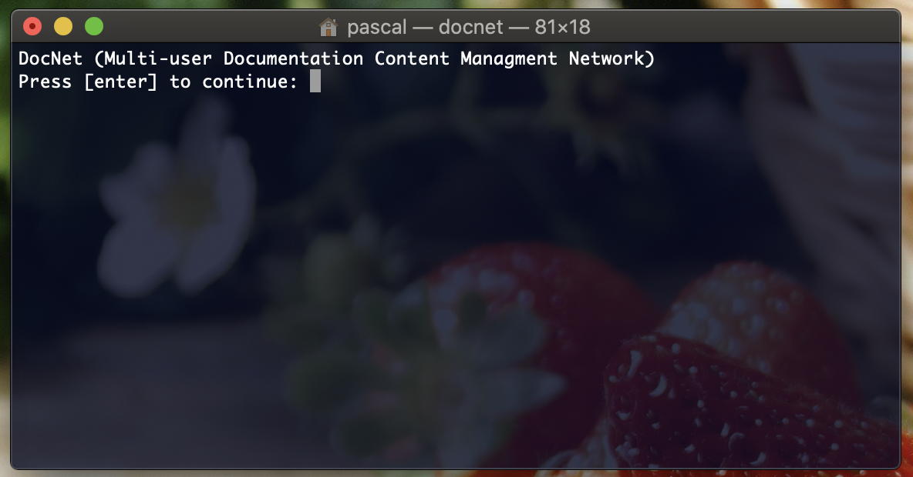
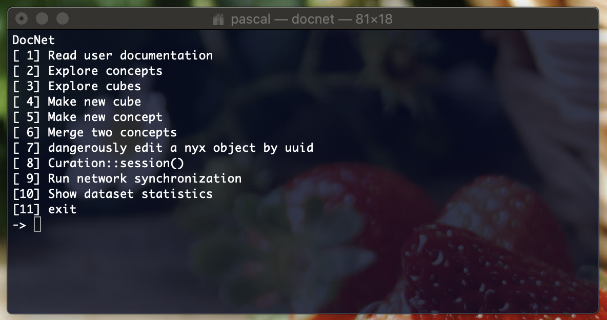

## DocNet

This is the home page of the DocNet end user documentation.

DocNet is a multi-user distributed documentation framework, built for the Guardian engineering department. DocNet became an active project mid 2020 and is a work in progress.

In this documentation:

- How to aquire it and get it to run.
- The basic functions 
	- Exploration of the knowledge network.
	- Creation and edition of new datapoints.

DocNet...

- Was born as a terminal application (a purposeful choice by its author, Pascal), but will acquire other user interfaces as time goes on. 
- Is written in Ruby (because the program it is a subset of, Catalyst, is written in Ruby). But note that Catalyst (and therefore DocNet) is going to be rewritten in Go.
- Has an interesting data model. The reader is invited to get familiar with it to better understand the user interface. See [DocNet Datamodel](DocNetDatamodel.md).
- Makes no assumption about the documentation files. Text, pictures, .md files, Word documents, anything goes... So you do not need to convert your existing files to anything. Also, if you already have documentation written in Google Docs, just link to that, in this case DocNet acts as an index.

### Installation and running

Currently the shared store is a github repository [shtukas/docnet-data-store-1](https://github.com/shtukas/docnet-data-store-1). You need to ask Pascal to add you as a collaborator.

There is only one dependency that you might not already have installed: the `curses` gem.

```
$ gem install curses # or sudo gem install curses
```

DocNet is currently distributed as a github repo, so do clone the repository [https://github.com/shtukas/catalyst](https://github.com/shtukas/catalyst) and then 

```
./docnet
```

at the command line, and that's all. You should then be greeted with this screen.



followed by 



Note that depending on your permission level, less than those 11 options may be presented to you. 

Note that DocNet will store its data here: `~/.docnet`.

### Where to go from here?

- [DocNet Datamodel](DocNetDatamodel.md) To learn more about the data model 📐
- [DocNet Search and Navigation](DocNetSearchAndNavigation.md) To learn how to navigate the knowledge graph 💡
- [DocNet Nodes](DocNetNodes.md) To learn how to view, edit and create new nodes and become an awesome contributor of the knowledge network 👏
- [Doc Network](DocNetwork.md) To discover how DocNet performs communication between users 🛰
