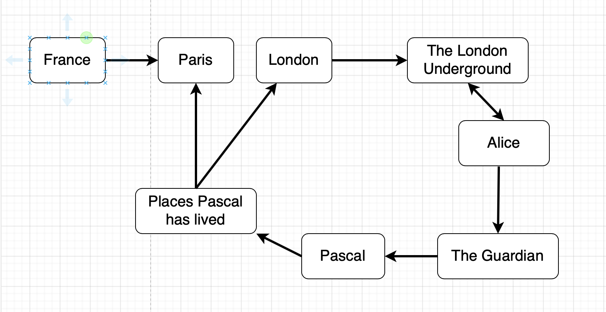
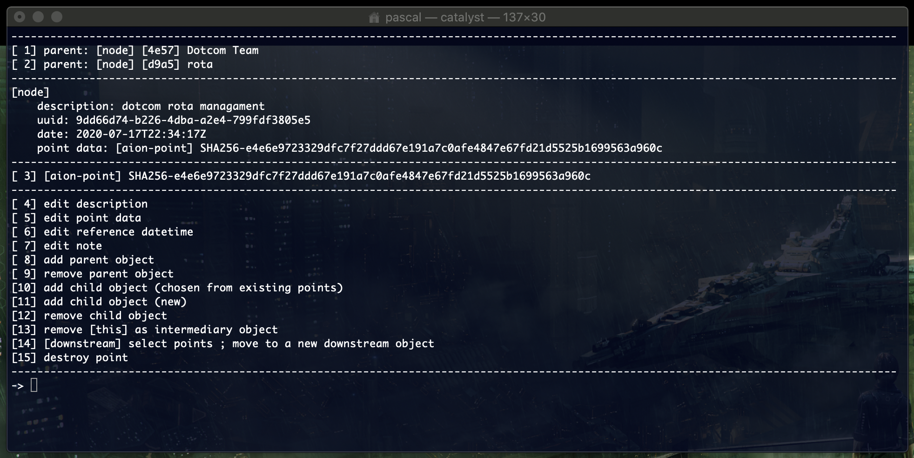

## The DocNet DataModel

The DocNet datamodel is very simple. It's essentially just a set of nodes and directed links between them. We often refer to links as *arrows*. An arrow from [A] to [B] is meant to express that there is a semantic path from [A] to [B].

For instance [London] is a node, so is [The London Underground]. Because "London" is intuitively a more general node than "The London Underground", we would put an arrow starting at [London] and ending at [The London Underground]. 

When there is an arrow from [A] to [B], we say that [A] is a **parent** of [B], and that [B] is a **child** of [A]. Because there isn't any restriction between the start and end of arrows, any node can be a parent or a child, and, of course, any node can have any number of parents (0, 1 or more) as well as any number of children. 

Note that unlike tree-like structures, the DocNet network can easily have loops. For instance

```
[London] 
    -> [The London Underground]
        <-> [Alice]
            -> [The Guardian]
                -> [Pascal]
                    -> [Places Pascal has lived]
                        -> [London]
                        -> [Paris]
```

Depending on the nature of the source and of the target of the arrow, the arrow means something slightly different. 

For instance, in the above example the first arrow means "has" (London has an underground). The second arrow means "Alice has been staff of The London Underground". Also note that there is a link from Alice to the London Underground (because the person who set those links up, mentally moves back and forth between Alice and the underground without any preferencial direction). The arrow from Alice to The Guardian is because Alice has donated to the newspaper. The link from the Guardian to Pascal means "Pascal is a staff of the Guardian". The link from [Pascal] to [Places Pascal has lived] is that of a sub node, and the last link means "that list contains..."

Another way to represent that mini network is like this:



This last picture is how we mentally intuitively represent the nodes and the arrows. 

Note that DocNet makes no attempt whatsoever at capturing the different kinds of arrows. That difference exists in the mind of whomever navigates the network (and varies from one person to another). From DocNet's point of view there is one type of arrow.

The DocNet user interface remains faithful to that view and when focusing on a node, shows it's contents (if any), its parents and its children.

 

See the [Nodes](DocNetNodes.md) documentation for more details about this screenshot, but for the moment we are focusing on a node called "dotcom rota management", which have two parents, one called "rota" and the other one called "Dotcom Team". The data carried by this node is a text file where I manage the rota system of the dotcom team. Also note that your display of this node might be slightly different (less operations avalaible to some users).

