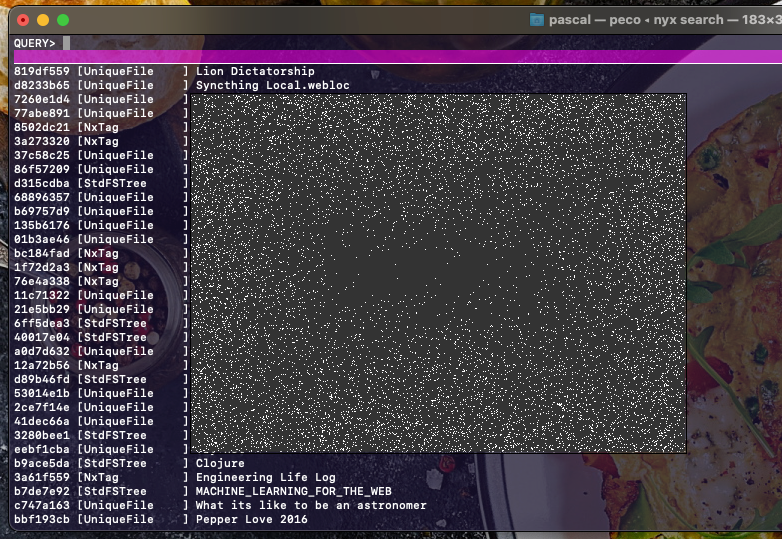
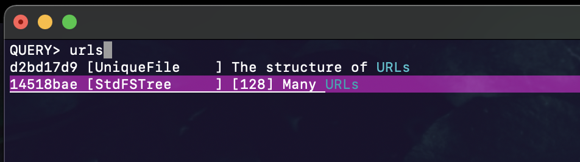
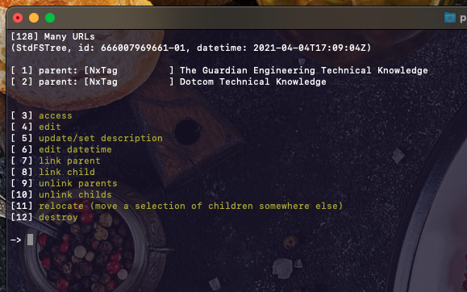
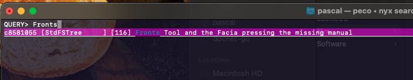

The current version of this page is not the DocNet (which is being re-written) user manual, but a showcase based on the existing Nyx interface, notaly the search features.

This afternoon a colleague asked on my team channel if anybody remembered the url to the config part of the CODE version of the Fronts tools. 

First, running 

```
nyx search
```

The landing page is 



(I scambled it a bit for privacy). I know I have a folder with a bunch of URLs covering various stuff, so I typed "urls", it then became: 



I knew I was looking for the second item. I selected it and landed on that node of the network. 



As we can see it has two parents "The Guardian Engineering Technical Knowledge" and "Dotcom Technical Knowledge"

The nodes are sometimes connected. There is the **arrow**, `House -> Living Room`, means that `House` and `Living Room` are two nodes of the network and that `Living Room` is a child of `House`. But you could also have `Bonnie  <-> Clyde` in which case it's not an arrow but a **link**. A link is bidirectional and simply means "If you are looking at the `Bonnie` node, you might also be interested in the `Clyde` node"

The fact that the `Many URLs` node has those two parents, is because I think it's both a part of my team (Dotcom)' knowledge, but also a part of the department's knowledge.

The Type of that node is `StdFSTree`. This means that the node is an entire file hierarchy. When I selected [access] Nyx  opened a Finder window.


Note that the way Nyx seems to be presenting those node contents is totally Nyx specific, DocNet will not archive hierarchies that way. 

I actually didn't find exactly what I was looking for, but I remember that since the person who asked was actually talking about Fronts, I could query that 🙂

The only result was:



At that moment I actually wet back and updated the information in the "Many URLs" node. And here is the important bit. In DocNet that update will be propagated to all other users seemlesly. The next person to look into "Many URLs" will find the latest version. 
