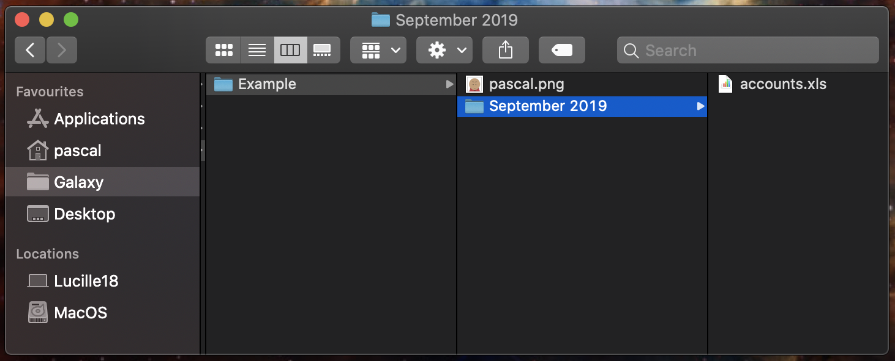
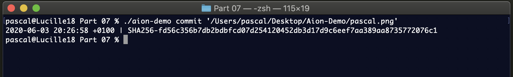
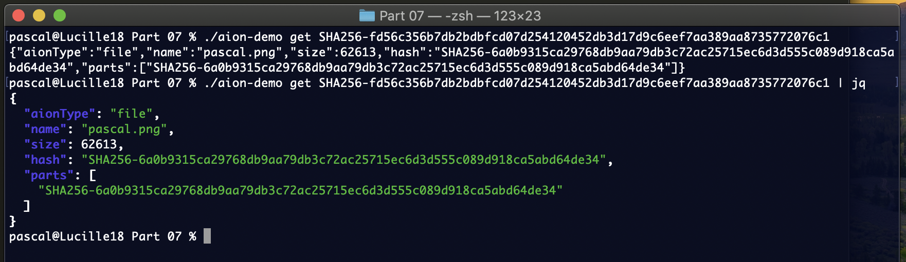
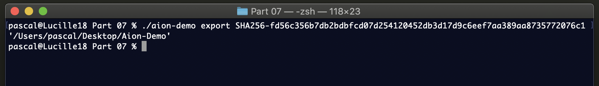
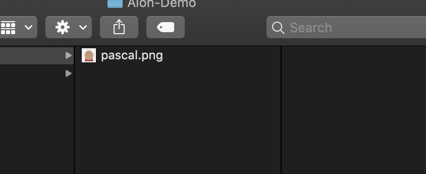
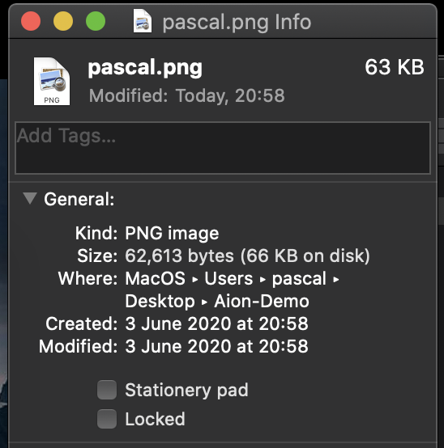
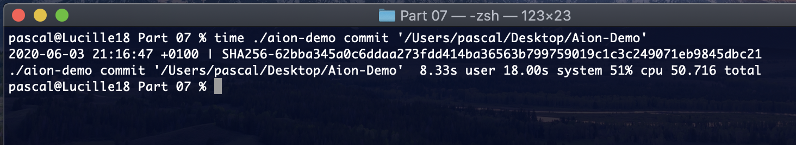
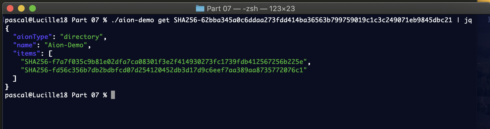
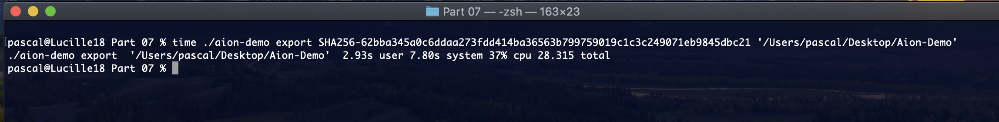

## Introduction to Hash Functions, Merkle Trees and Aion Points

### Part 1

So in this series (I don't think there's ever been _series_ posted on Chat, so maybe that's going to be the first one), I am going to show the design and implementation of the file system that underlies Catalyst. Catalyst is a one of Pascal's major personal computing tools and it manages a large amount of personal data.

We are going to move bottom up, from the manipulation of data blobs up to the (recently introduced) Global Data Navigation Network, also known as Starlight. I will post a new entry every day. Feel free to comment (or ask questions) between entries.

In the first few entries, I am going to cover some basics, that most engineers already know, but they are super important for the rest.

Today we are going to clarify "Content-addressable storage".

Imagine that you are designing a storage system, a library with a very simple API. You want clients of the library to store (binary) data against a string key. Your library could just have two functions

```
put(key, data)
```

and 

```
get(key)
```

where `key` and `data` are, respectively a string and binary data. And for the `get` function you can use whatever facilities your language provides as return value when there was no data stored against a given key. In Scala you would `Option[BufferedInputStream]` it. 

To simplify the text and focus on just what I want to show, I am going to assume that you decide to store the data in a database (this is just to put the scene). The database needs to have at least one table and two columns. In sqlite, you could do

```
create table storage (key text, data blob)
```

This would work.

People, at work, use your API but then you discover to tiny little problems. 

1. People often store the same data, and those blobs are quite big (like there is a movie club in the office and people share gigabytes long videos with each other and the same video ends up multiple times in the database).

2. Turns out that your storage is not that reliable and sometimes the binary data gets corrupted, resulting in what being `get` not equal what was `put`.

One colleague hears about those problems (the second one is quite serious actually) and says "You should just content address it, let me pair with you on it". 

You now have a database with 2 tables

```
create table lookup (key text, hash text)
create table storage (hash text, data blob)
```

When `put(key, data)` is being called, the sha256 hash of `data` is computed and the first table is populated, then the second table is populated (please do both atomically).

For instance if I did

```
put("secret", "Pascal")
```

the first table would get

```
("secret", "44c550b0e0f3380f5de2a889454e576f26164a1b8a109222354fc5089e383057")
```

and the second would get

```
("44c550b0e0f3380f5de2a889454e576f26164a1b8a109222354fc5089e383057", "Pascal")
```

Now, if I then did 

```
put("secretly", "Pascal")
```

the first table would get

```
("secretly", "44c550b0e0f3380f5de2a889454e576f26164a1b8a109222354fc5089e383057")
```

But nothing would need to be added to the second table, because the tuple `("44c55...", "Pascal")` doesn't need to be duplicated.

In the second implmentation of the storage system, *deduplication* happens by default. When the same data is re-added, under another key, then no extra space needs to be used for the data itself, just a new entry is added in the lookup table, but that's small, and independent to the size of the data itself.

Now replace "Pascal" by a much larger piece of data, and see how you just saved yourself some space. It doesn't matter if the same gigabytes file get stored 1000 times against 1000 different keys, you will have 1000 entries in the lookup table, but only one in the storage table. The only way that file would get a new entry, is if somebody edits it, because then it would get a new hash.

Moreover, when somebody runs

```
get("secret")
```

before "Pascal" is returned to the caller, the sha256 hash of what was stored is computed and compared with the first part of the record. If they match, you know the data "Pascal" has not been tampered with. This is called *self validation*, or *built-in integrity checks*.

So what we have discovered is that from the above use of hashes when storing data, we get deduplication and built-in integrity for free :)

### Part 2

We keep the same context as yesterday, a data store with two functions `put` and `get`. We have learnt that beyond the most trivial implementation of the store, whereby one stores the data directly against the keys, there is a simple improvement, using computed hashes, which immediately causes deduplication and error detection / integrity.

Today we are going to focus on integrity and learn about *Merkle trees*.

To do so, imagine that as you migrate your system to a new storage, you are told that there is a limit on the size of the blobs you can store (in yesterday's example datablobs could be as big as the client wanted -- storing entire video files against a single key if they wanted). Today we have a limit of 10Mb.

When somebody calls `put(key, data)`, the following happens:

1. `data` is split in chunks of 10Mb, resulting in `[chunk(1), chunk(2), ...., chunk(n-1), chunk(n)]`. All the chunks from `(1)` to `(n-1)` are 10Mb and the last one less. (The last one's size is size of the data modulo 10Mb).

2. You compute the sequence of hashes `[hash(1), hash(2), ...., hash(n-1), hash(n)]`, where `hash(i)` is the hash of `chunk(i)`.

3. You store each chunk against its own hash, thereby calling `put(hash(1), chunk(1))` and then `put(hash(2), chunk(2))` etc...

4. You consider the string representation of the sequence `[hash(1), hash(2), ...., hash(n-1), hash(n)]` (reasonably assumed less than 10Mb long ^^) and call `put(key, "[hash(1), hash(2), ...., hash(n-1), hash(n)]")`.

That was storage. Now retrieval...

When somebody calls `get(key)`, first you, well..., retrive whatever is stored there, meaning `"[hash(1), hash(2), ...., hash(n-1), hash(n)]"`, and deserializing and looping over the array, you call `get(hash(1))` etc... Then concatenating the blobs you get the original data. 

Now few observations.... 

Well essentially one. 

The hash that was stored against `key`, represents information *about the entire sequence of hashes* and by extension the entire sequence of chunks, and by entension the entire original data. 

In fact, what we have here is a tree of depth 2. We have the root hash, which completely determines the sequence of children hashes, and that itself completely determines the sequence of blobs. 

Changing a single bit in one of the blobs, would change its hash, which would change the sequence of hashes, which would change the root hash. 

Generalising, a Merkle tree is a tree with nodes labelled by hashes where the hash of a node is determined by the hash of all its children, from the root down to the leaves. 

(*git* uses that to ensure integrity of its hierarchical data structures ^^)

Something else. If two files sent to the store are identical for the first 100Mb but differ after that for few Mbs, then they will share the same 10 first chunks. Yeah, you know where I am going: #deduplication. The chunks that are identical between the two files will not be stored twice :)

Just remember that a Merkle tree is a tree of interdepending hashes, and as we can now see, content addressage (yesterday's example) was a simple example of that, and as we have seen today, can be used for more complex deduplication and self validation / built-in integrity. 

### Part 3

Today's update, (before we start moving to more interesting things) is going to be short, I just want to mention one thing: #caching.

People often say that the two hard problems of computing are "naming things" and "cache invalidation". Well, hashes solve both. First you don't need to think about how to name things if you call them by their content (that's the former problem solved -- tongue in cheek), and hashes, and one of their generalisations, Merkle trees, completly solve the document cache invalidation problem. Why? Because *content address cached data never expire*.

Assuming the datastore we considered in Part 1 and 2 becomes slow (network latency, they moved it on the other side of the planet, whatever...), then, when you retrive data by requesting blobs by their hash, if you have a nearby service (even one that you completely mistrust) that says "Hey, I have that hash you are about to query for", you just take what it gives you, compute the hash of that and if the computed hash matches what you were about to ask for, you know you have the data you wanted.

This principle expands to hierarchical threes. If you want to retrieve a document starting with its root hash and you realise that your local cache (or the completely unstrusted service that is faster than the remote server of truth) happens to recursively give you some of the blobs you need, then no need to ask for them remotely. Some nodes will be available locally because, at some point in the past, something (not necessarily you) asked for them and they were still lying around in some cache.

Leading me to a remark. 

If when we serve theguardian.com, we served our fronts or articles as hierarchical structures, when you ask for them the first time then all the data will have to be sent over to you (text, pictures, css, js, etc). But if the day after you ask for the same url and the tiny (few characters long) string (root hash) that is first sent over to you can be recursively reconstructed from the local hash, you don't need anything else, and if you come back a thousand years later and the same root is sent back to you and you still have enough data in your cache, or other closeby caches, to reconstruct the entire document, then nothing else needs to be done.

Imagine, though, that a paragraph is changed few hours after your first visit. From that node up to the root all the hashes will change, but the rest of the tree will be identical. You will have to ask for few things to the remote server, but, and this is where the awesomeness lies, you will in fact only download the *diff* between the first version of the page and the new version of the page. No unecessary data you already have will need to be requested.

And if somebody wants to say "I know this! Git did it!". Yeah, now is the moment :)

... to be continued ...


ps: (1)

I need to mention this...

No unecessary data you already have will need to be requested.

Even if it was downloaded from another news site, or another website, or was a part of the data from a online video game you played recently 🙂

ps: (2)

.
So in fact, I have just had this thought as well, assuming you have the same blob cache for all your web activity (with an appropriate garbage collection policy -- not because stuff expire but because of space pressure), everytime you ever request anything on the web, you always only have to download the diff between (1) what you want and (2) the closest (measured in diff size) document that can be built using what you already current have in the cache.

(I have a similar such cache on my computer, collectively used by many of my programs, which I will maybe talk about later in this series, which I gave 10Gb of disk space to.)

### Part 4, Summary of what we have seen so far*

So far we have (re)discovered content addressing (Part 1), quickly explored one of the generalisations of the idea of validating data with hashes, Merkle trees (Part 2), and observed (Part 3) that since content addressed cached data never expires, is also self validating and works agnostically to what may have cached it in the first place, we can devise aggressively efficient storage systems and data transfer protocols (I alluded to what could be if we moved that idea to the way we transfer websites -- would require a slight redesign of the "web" but one which would have amazingly far reaching consequences, see IPFS below).

Before we move on, let me just give pointers if you want to know more about those things:

- https://en.wikipedia.org/wiki/Content-addressable_storage

- https://en.wikipedia.org/wiki/Merkle_tree

- https://ipfs.io (IPFS, which I gave a techtime about in the past, builds on the two above ideas)

There are other projects that are bringing those ideas to "mainstream", but one that is particularly fun for me to observe is the Unison language: https://www.unisonweb.org ( _Unison is an open source functional programming language based on a simple idea with big implications: code is content-addressed and immutable._ ) Yeah, not only data can be content addressed, but computation as well. An amazing idea whose consequences, we are just starting to explore and understand.

### Part 5

We are going to be spending this part and the next two parts exploring the logic of a library called Aion that I made many years ago. It's going to illustrate more in details how Merkle trees work and what we can do with them, this time in relation to file systems. In this part, and the next (Part 6) I am going to explain its logic, and in Part 7 I am going to demo it by showing one of its implementations.

(The name Aion comes from the eponym MMORPG that I discovered while looking for a name for the library).

An easy to think of use case for Aion could be (but is not limited to) somebody who wants to make timed snapshots of a standard file system, and also to be able to go back in time and restore data from them. There are lots of way this problem has been solved (currently, and at least for my computer data, I am using a wrapper around rsync for this), the interest with Aion is educational and to show how it can be done in a simple way (that comes with some interesting side effects).

The context (what we assume we already have) is a key/value store (with only two functions, `put` and `get`). We are going to assume that it's content addressed, therefore when we store we do not need to provide a key. We store a blob of data by `put(data)` and the value returned is the hash of the blob. When we want a blob, we provide the hash that was given to us when we stored it. The storage API acts exactly like the coat handling service when you go to the theater, you give your bag and coat to the person across the desk and they give you a ticket, which you then use later to retrive what was stored. The fact that in our case tickets are hashes helps with data integrity and automatically cause deduplication (as we have seen in previous parts).

If we want to store a classical file system, with files and folders (of files and folders), we need a way to represent those.

Let's start with a file. A file is a blob of binary data (its content) with some metadata (name, permission flags etc). Today we are only interested in the name. We represent a file as follow

```
{
    "filename": String,
    "hash"    : String
}
```

If we want to "store" this file using the key value store, say a picture called "Darth Vader.jpg", first we send the file's data itself to the store, we get a hash "5fc12d79e455" (I am using small strings for convenience). That hash represent the binary data itself. Then we build the JSON object

```
{
    "filename": "Darth Vader.jpg",
    "hash"    : "5fc12d79e455"
}
```

... consider its simple serialization `{"filename":"Darth Vader.jpg","hash":"5fc12d79e455"}` and sends that to the store to be given another hash, say, "557ee40a-c68a", which is what I am going to keep.

When we want to "retrieve" the file, we retrieve whatever is stored against "557ee40a-c68a", then JSON deserialise that (at which point we know the name of the file, but don't yet have its content), call for the data stored against "5fc12d79e455" and we can now write a file called "Darth Vader.jpg" against the binary data we last retrived. 

In a previous part we saw that we might realistically have a limitation on the size of the blob we can store (limitation of the storage API itself). In that case we need to split the files we store if they are too big. To represent that we will instead consider this to present files. 

```
{
    "filename": String,
    "content" : Array[String]
}
```

We replace a single hash by an array of strings (meant to be the hashes of sections of the file, in order). The retrieval process is similar. When we want to retrieve a file, we get the JSON object (by its hash), deserialise, call the blobs using the array, concatenate them and give the right name to the file. 

In the next part we are going to do the directories. I let you guess how that will work :)

ps: The limitation I considered on the API is not because we cannot build a storage api without that limitation, but because the very naughty people we are are going to abuse things that were never intended to be used as storage, such that using url shortening systems, such a tinyurl.com, to store the sections of our files 😅, or as extra metadata embedded in pictures sent to imgur.com. I did both, but those are stories for another time... 😊

### Part 6

In this part we are following the review of Aion started in part 5. Remember that we already have decided the way we want to represent files

```
{
    "filename": String
    "content" : Array[String]
}
```

Directories are simple, they are just a name and some content/items. I am going to use the word "item" to refer to what's inside a directory. Those items can be files or directory themselves. We represent a directory like this

```
{
    "name"  : String
    "items" : Array[String]
}
```

Where the array is an array of file system objects hashes. Each file system object is either a file or a directory. In fact let's update our object definition a bit to indicate the type.

```
{
    "type"     : "file"
    "filename" : String
    "content"  : Array[String]
}

{
    "type"  : "directory"
    "name"  : String
    "items" : Array[String]
}
```

Now, when we are given an object, we know, by the value of a type what it is. 

Here is an example of a directory and some contents in it:



Let's send the directory "Example" to the key value store.

The method we follow (and this is reflected by the fact that the corresponding code --in the programming language of your choice-- is recursively defined) is this:

Step 1: `put` the content of the file "pascal.png", be given "d30c35a2"

Step 2: `put` the JSON object (serialised)

```
{
    "type"     : "file",
    "filename" : "pascal.png",
    "content"  : ["d30c35a2"]
}
``` 

and be given "671aafdf". At this point we have stored the file "pascal.png" (its contents and the metadata object carrying its name).

Step 3: `put` the content of the file "accounts.xls", and be given the hash "a6f421db".

Step 4: `put` the JSON object 

```
{
    "type"     : "file",
    "filename" : "accounts.xls",
    "content"  : ["a6f421db"]
}
```

and be given "57868342". At this point we can build the object representing the folder "September 2019". 

Step 5: `put` The JSON object

```
{
    "type"  : "directory",
    "name"  : "September 2019",
    "items" : ["57868342"]
}
```

And be given "756015bd". Note that the array in the directory object contains "57868342", which is the token to retrive the "accounts.xls"'s metadata object, and not, "a6f421db", the token to retrive the file content :)

At this point we have "671aafdf" for the file "pascal.png" and "756015bd" for the directory "September 2019". We can then build the object for directory "Example"

Step 6: `put`

```
{
    "type"  : "directory",
    "name"  : "Example",
    "items" : ["671aafdf", "756015bd"]
}
```

And be given something (the root hash). As you can see it's a completely recursive process and the root hash completely determines the entire structure below it (shape of the tree, name of the files and folders, content of the files).

If one day you want to reconstruct the entire file tree, it's easy. Start with the root hash (the only thing you have), `get` something, which you know has to be a JSON object, so JSON deserialise that. 

```
{
    "type"  : "directory",
    "name"  : "Example",
    "items" : ["671aafdf", "756015bd"]
}
```

Look up the type, see that it's a directory. `mkdir` it. Then you know the directory has two items in it (2 is the size of the "items" array), `get` "671aafdf", which you know is a JSON object, 

```
{
    "type"     : "file",
    "filename" : "pascal.png",
    "content"  : ["d30c35a2"]
}
``` 

Look up the type, it's a file (and you know its name), `get` the binary data using "d30c35a2", write the file, and carry on doing the same with the other item in the top directory, "756015bd", but by then you know what to do, recursively :)

Among other things we have learnt something absolutely fundamental here: we can send an entire file tree to a key value store, in a way that ensures integrity and deduplication (I will come back illustrating that last point in the next Part). 

Writing the code of this library took less time that writting two posts about it. The code is small, recursive and very obvious when you actually write it (above all when the `put` and `get` functions are already given). This highlights something: there is a difference between the modelization of the file system core concepts and the mechanism used to store binary blobs and metadata. Various file systems take different approaches, but everything made following the approach taken by Aion takes a great advantage in keeping both concerns separate. In particular, your file system objects are absolutely the same regardless of the storage mechanism(s) you use. This has very important consequences in the durability and portability of your file system.

I am going to stop here because that's enough to play with for a day, but next time we will see Aion in action (^_^)

### Part 7

In the previous part I said we would see the Aion library in action. To do so I have just built a small cli tool, that I called `aion-demo`, to showcase it.

`aion-demo` uses an existing key value store that I have available on my computer and that is being used to actually put and get the data blobs. 

Aion itelf is completely agnostic of the storage mechanism and only implements the JSON objects manipulation we saw in the previous part, and therefore takes an object implementing a trait that expresses how to talk the storage. [We will see that in the next part]

Let's start with a simple file "pascal.png"


let's simply send the file to storage...

```
./aion-demo commit '/Users/pascal/Desktop/Aion-Demo/pascal.png'
```



The output is simply the current time and the root hash.

Let's now call the store to retrieve what's stored against the hash itself.



We see an object very similar to the one I introduced in the previous part. This one has two extra attributes though: `size` and `hash`. I had not introduced them for simplicity. 

`size` is used when one want to quickly know much space all the files of a tree take without actually pulling all the datablobs from storage (which can be an expensive operation when dealing with large datasets).

`hash` is the hash of the file itself. This is used as an extra level of protection, to test the integrity of a newly reconstructed file. In this case the file "pascal.jpg" is small enough that it was committed in one single blob. Obviously the hash of that blob is the hash of the file itself. 

Note that Aion prefixes its hash with the particular algorith it uses. This was particularly useful at some point. Aion was born with sha1 but I upgraded it to use sha256 when the first sha1 collision was announced. Some old datasets then had sha1 and sha256 objects in the same repositry coexisting pacefully. (Otherwise I would have discriminated between the two hashes by the fact that they have different lengths, but that would only have posponed a deeper problem).

While being at it, let's observe that the file object doesn't carry any timestamp itself. If it did the operation of commiting a file to the repository would not be idempotent, deafeating the content addressing nature of the design. If I commit the same file again (without making any modification to the binary contents). I get the very same output. 

Now let's delete the file.


... and reconstruct it from storage.

```
./aion-demo export SHA256-fd56c356b7db2bdbfcd07d254120452db3d17d9c6eef7aa389aa8735772076c1 '/Users/pascal/Desktop/Aion-Demo'
```





Et voila!

`export` takes two parameters, the root hash and the location on your file system where you want the reconstruction to happen.

Note that the file that has been reconstructed doesn't have the all same posix attributes as the one that was there before. In particular it has a completely different times (modification, creation etc...). It's just the same file binary-wise and has the same filename.




Now let's do another commit. I am going to commit the directory `Aion-Demo`, after having put the entire `frontend` codebase next to the picture (That's more than 10,000 files).

```
./aion-demo commit '/Users/pascal/Desktop/Aion-Demo'
```




... which took 50 seconds.

If I now query the root object of what has just been committed, 

```
./aion-demo get SHA256-62bba345a0c6ddaa273fdd414ba36563b799759019c1c3c249071eb9845dbc21
```



As expected the root object is a directory called `Aion-Demo` that has two items in it: my avatar (file) and frontend (a directory). I can now delete the Aion-Demo directory and use `export` to get all of it back.



... which took 21 seconds.

### Part 8

Ok, let's make some progress and finish the review of Aion, so that we can start talking about exotic file systems next time :)

First let me focus on one tiny details from last time. When we did the commits of our file hierarchy into the key-value store we were given this:

```
2020-06-03 20:26:58 +0100 | SHA256-fd56c356b7db2bdbfcd07d254120452db3d17d9c6eef7aa389aa8735772076c1
2020-06-03 21:16:47 +0100 | SHA256-62bba345a0c6ddaa273fdd414ba36563b799759019c1c3c249071eb9845dbc21
```

We know what the hashes are (roots of merkle trees), but having them with timestamps means that we now have an history of our dataset. If we store those timestamps/hashes pairs we could easily go back in time and recontruct our dataset at it was in the past. In fact, since it is very cheap to make those snapshots (only the first one takes as much space as the original dataset as the others are essentially deltas) we can visualise a situation where such a snapshot would be done after each mutation of the dataset.

Something else I need to mention it that I have carefully avoided fgiving details about the key value store. I have use Aion against SQLite files a lot in the past. This means that you can carry your dataset or your file system and all it snapshots in a single file, a bit like a zip file, but much _much_ better.

At this point, we could make another decision, and link the snapshots by deciding that the hash of a previous snapshot is also used to compute the next one. At this point we would have reivented two things: git and blockchains :) Indeed, I have noticed that when one goes into building file systems and snapshot systems on good principles they are bound to accidentally reinvent git in one form or another.

It is likely that if a version control system were to be invented today, it might take this form (a CLI tool with an adapter to send the data whereever you want while keepting the very same logic). I think that what make git different from all other possible merkle tree based systems is that Tolvard wanted to use the existing file system to store the data and metadata without relying on anything else. He then decided that git would put all its junk in the `.git` subfolder.

Something I want to mention is that, Aion only stores file names (and directory names) and file sizes. This is fine for many purposes, but if we wanted to store permission flags and other file attributes, this would be easy: just add those to the Aion objects.

Something else I need to do is to show you the source code of Aion (I said a couple of entries ago that it was straiforward). The version I am showing is written in Ruby: https://gist.github.com/shtukas/5b6bdd867fcfcfe83266d733e814450f . You will notice at the bottom something called `AionFsck` with two functions, it's the file system check, like `fsck` for most unix file systems. You can use it to recursively check the integrity of a merkle root.

Now let me show you the code of the tiny cli tool I used to demo Aion last time:  https://gist.github.com/shtukas/58efe5d812dd3fc66d8cedbaf6ce8682

As you can see it uses `KeyValueStore.rb` which provides a key value store API to numerous personal tools. Elizabeth is the class that one can write to give storage to Aion itself. This is while the function to commit a file hierachy is called like this

```
AionCore::commitLocationReturnHash(Elizabeth.new(), location)
```

If you write a Elizabeth-Gmail, or Elizabeth-DNS, or Elizabeth-Random-Online-Image-Service, you will be ~using~ abusing the corresponding services to store your file system 🙂 last but not least, Elizabeth is where you want to encrypt and decrypt your data blobs. 

*Summary*:

So far we have explored content addressing, learnt about Merkle trees and see the design and code of Aion (an application of Merkle trees to the problem of self validating deduplicated timestamp versionned snapshots of file system trees). Doing so we experienced what's it is like to work with the ideas and how easy it fells. The code is simple, the objects straightforward and keeping them abstract and independent of core storage routines helps with understanding, correctness and portability.


### Part 9

I have a tiny tool (atlas) that let me find files by their name regardless of where they are on the hard drive. It's trivial: just a traversal of the entire file tree until it finds a file with that name (and when it does find it caches the location for the next time the file is being searched). I am interested in that functionality because there are moments I (well not me exactly, some of my tools) refer to files only by their names This is because those names are unique but the location of those files is not fixed and can be moved by other tools for other reasons. 

For instance I have a wallpaper called `9wHrewC1Dyf2AuqEqwWcg.jpg`. That's a unique name, and it's referred to somewhere, but I also have a daemon that moves wallpapers around (for some reasons) resulting in the location of that file no being fixed. 

Things are fine if all the files that can be searched by name are always on the local drive, but sometimes entire parts of the file tree are relocated onto one of my external drives, and when I search for a file by name and can't find it, I can't tell if it was because the file was legitimely deleted by some process or relocated by me.

Enter ShadowFS

ShadowFS performs the same tree encoding that Aion does (see previous parts), but instead of coping the contents of files, it only register their names.

Remember that Aion's idea of a file was

```
{
    "type"   : "file"
    "name"   : String
    "size"   : Integer
    "hash"   : Hash
    "parts"  : Array[Hash] # Hashes of the binary blobs of the file
}
```

whereas for ShadowFS a file is simply 

```
{
    "type"   : "shadow-file"
    "name"   : String
}
```

The directories are still

```
{
    "type"  : "directory"
    "name"  : String
    "items" : Array[Hash] # Hashes of serialised Aion objects
}
```

All my drives have a shadow copy of their entire file tree in the general key value store, using shadow file objects. That shadow copy is obviously lightweight (a collection of tiny json objects) and doesn't have any of the binary blobs of the files, but the entire structure is preserved.

When a file is being searched by name by atlas, if atlas cannot find it on local, it then explores the external drives shadow copies and knows whether the file is on a dive and its location on that drive. Or knows it really doesn't exist anymore.

ps: In reality ShadowFS is slightly more useful, when it performs its shadow copy, if the file was small, then the aion object is built, meaning that other operations that may want to access the contents of that file can do so. This is for convenience of whichever process was exploring the shadow copy.


