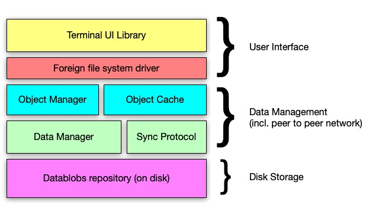

### Technical Portal

This is the entry point of the DocNet techinal doumentation and related documents.

- [Technical Architecture](Technical-Architecture.md)
- [Raw Data Storage](RawDataStorage.md)
- [Data Schema](Data-Schema.md) 
- [Data Manager](Data-Manager.md)
- [UI Library](UI-Library.md)
- [Transmutation](Transmutation.md)
- [Fsck](Fsck.md)

### Some related documents and technologies

- [A File Structure for the Complex, the Changing and the Indeterminate (Theodor H. Nelson, 1965)](https://andymatuschak.org/files/papers/Nelson1965.pdf)
- [Camlistore](https://perkeep.org), now known as Perkeep. Notably the two first videos: [Camlistore Intro & Status Update, 2013](https://www.youtube.com/watch?v=yxSzQIwXM1k) and [Camlistore at FOSDEM, 2014](https://www.youtube.com/watch?v=kBCQq5hfsug).
- The [Hypercore Protocol](https://hypercore-protocol.org).